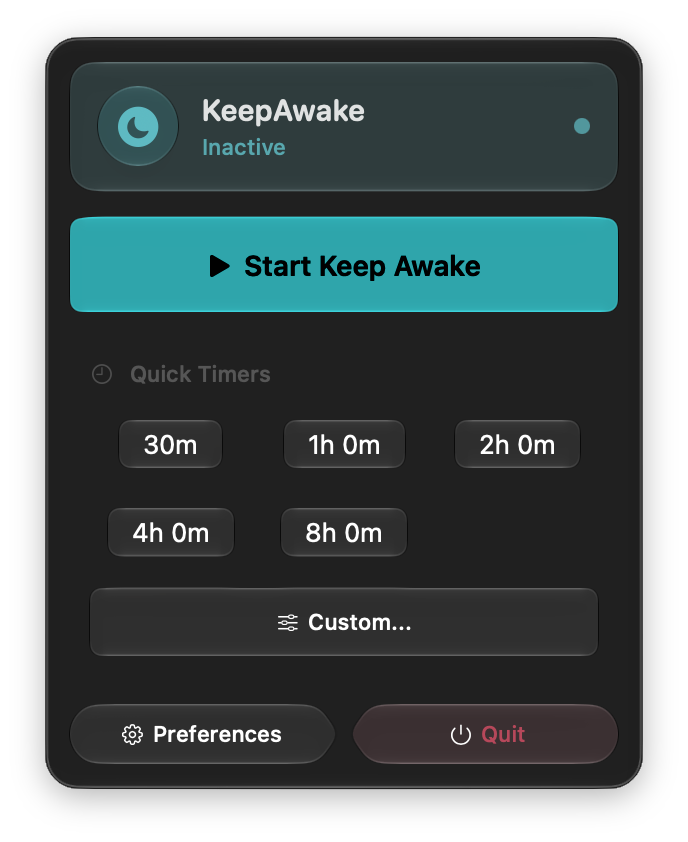
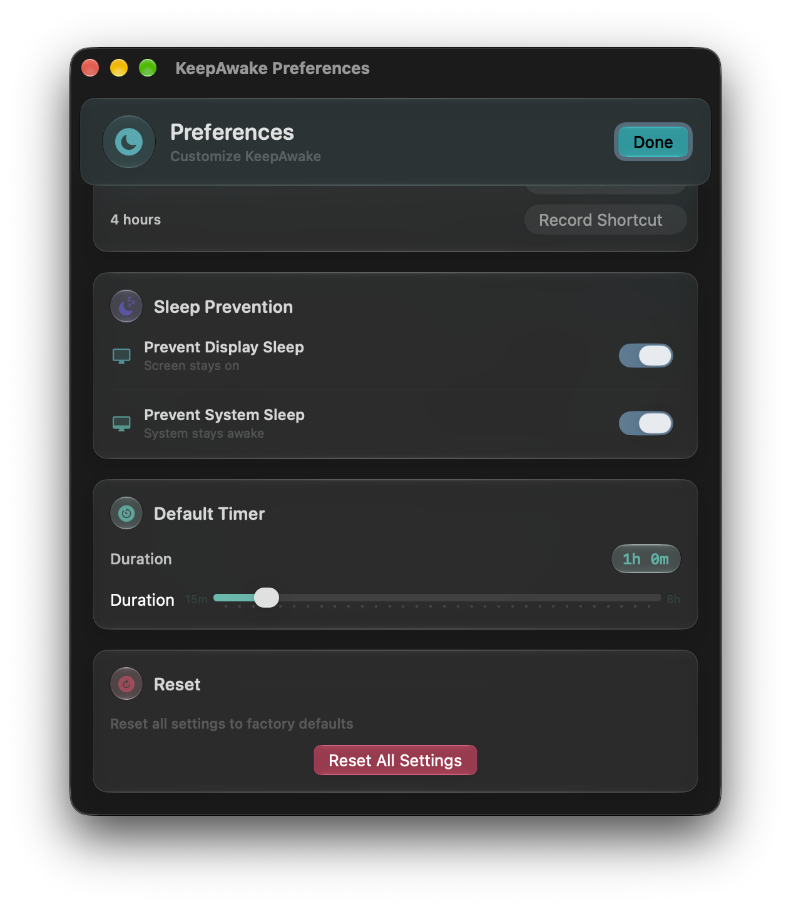

<div align="center">


# KeepAwake

**Keep your Mac awake — a lightweight native menu bar app.**

[](LICENSE)


</div>

KeepAwake is a small macOS menu bar utility that prevents your Mac from going to
sleep. It wraps the built-in `caffeinate` tool in a clean SwiftUI interface, with
quick timers, global keyboard shortcuts, and launch-at-login support.

## Features

- **One-click toggle** — keep your Mac awake indefinitely from the menu bar.
- **Quick timers** — 30 min, 1 h, 2 h, 4 h, and 8 h presets, plus a custom timer.
- **Live countdown** — see the remaining time and a progress bar while a timer runs.
- **Dynamic menu bar icon** — moon when inactive, sun when always-on, timer when counting down.
- **Global keyboard shortcuts** — toggle and start timers without opening the menu.
- **Configurable sleep behavior** — prevent display sleep, system sleep, or both.
- **Launch at login** — optionally start KeepAwake automatically (via `SMAppService`).
- **Native & lightweight** — SwiftUI, no third-party background daemons.

## Screenshots

> Add your own captures to `docs/screenshots/` and they'll show up here
> (⌘⇧4 then Space to capture a single window on macOS).

| Menu bar | Preferences | Custom timer |
| :------: | :---------: | :----------: |
|  |  |  |

## Keyboard Shortcuts

| Action | Default shortcut |
| --- | --- |
| Toggle Keep Awake | <kbd>⌘</kbd> <kbd>⌥</kbd> <kbd>Space</kbd> |
| Start 30-minute timer | _unset — configure in Preferences_ |
| Start 1-hour timer | _unset — configure in Preferences_ |
| Start 2-hour timer | _unset — configure in Preferences_ |
| Start 4-hour timer | _unset — configure in Preferences_ |

Shortcuts are powered by [sindresorhus/KeyboardShortcuts](https://github.com/sindresorhus/KeyboardShortcuts)
and can be customized in **Preferences**.

## How it works

KeepAwake launches the system `/usr/bin/caffeinate` tool with flags derived from
your preferences:

- `-d` — prevent the **display** from sleeping
- `-i` — prevent the **system** from idle-sleeping

When you stop or a timer expires, the `caffeinate` process is terminated and your
Mac returns to its normal sleep behavior.

## Requirements

- macOS (Apple silicon or Intel)
- Xcode (to build from source)

## Building from source

```bash
git clone https://github.com/ahmadfaridabbas/KeepAwake.git
cd KeepAwake
open KeepAwake.xcodeproj
```

Then build and run the **KeepAwake** scheme in Xcode (⌘R). The
[KeyboardShortcuts](https://github.com/sindresorhus/KeyboardShortcuts) Swift
package is resolved automatically via Swift Package Manager.

## Permissions

On first launch KeepAwake requests:

- **Accessibility** — required by the global keyboard-shortcut engine.
- **Notifications** — optional, used for status alerts if enabled in Preferences.

## Project structure

```
KeepAwake/
├─ Core/        App entry point and window management
├─ Managers/    Caffeinate control, preferences, launch-at-login
├─ Views/       SwiftUI menu bar and preferences UI
└─ Utilities/   Keyboard-shortcut definitions
```

## License

Released under the [MIT License](LICENSE). © 2026 Ahmad Farid Abbas.
